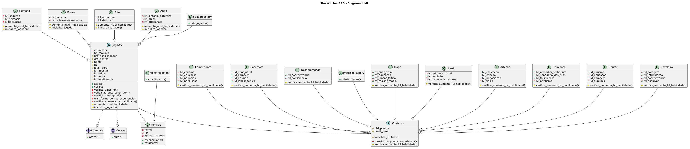

# ⚔️ The Witcher RPG - Versão Terminal

## 📖 Sobre o projeto

Este projeto foi desenvolvido como trabalho final da disciplina de **Programação Orientada a Objetos (POO)**.

O sistema consiste em um RPG inspirado no universo de **The Witcher**.

Nesta versão, toda a interação é realizada por meio do **terminal**, utilizando menus interativos em texto.

---

## ✨ Funcionalidades

- Criação de personagem;
- Sistema de combate;
- Diferentes monstros;
- Sistema de atributos;
- Menus interativos via terminal;
- Música e efeitos sonoros;
- Aplicação dos conceitos de Programação Orientada a Objetos.

---

## 🛠️ Tecnologias Utilizadas

- Python
- Biblioteca Rich - Python
- Biblioteca Pygame - Python

---

## ▶️ Como executar

1. Faça o download da Pasta "Versao Final - Via Terminal"
2. Instale as Bibliotecas necessárias

``` python
pip install rich pygame
```

3. Execute o arquivo main.py

---


# ⚔️ The Witcher RPG - Interface Gráfica

## ✨ Funcionalidades

- Interface gráfica intuitiva;
- Criação e seleção de personagem;
- Sistema de combate;
- Sistema de atributos;
- Aplicação dos conceitos de Programação Orientada a Objetos.

---

## 🛠️ Tecnologias Utilizadas

- Python
- Biblioteca gráfica utilizada no projeto PyQt5
---

## ▶️ Como executar

1. Clone este repositório:

```bash
git clone <https://github.com/Arieli-Leandro/Projeto-RPG-POO/tree/main/Versao%20Final%20Interface%20Grafica>
```

2. Instale as dependências:

```bash
pip install -r requirements.txt
```

3. Execute o projeto:

```bash
python player_inventory_interface.py
```

---
# Diagrama UML do Projeto



## 👥 Autores

Projeto desenvolvido para a disciplina de **Programação Orientada a Objetos (POO)**.

- Arieli Leandro Gutierres
- Maria Eduarda Cardoso de Oliveira
